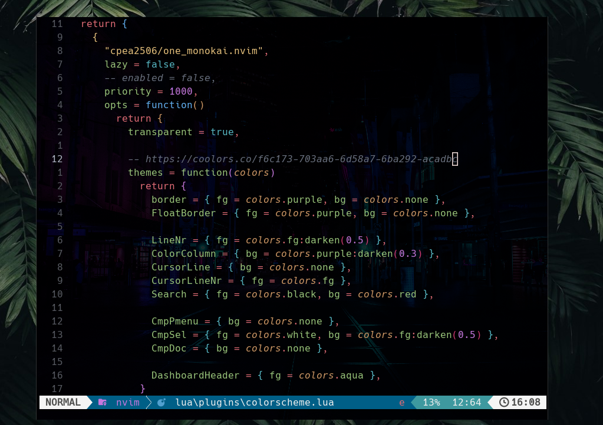

   

# My dotfiles

### Neovim
- [Neovim](https://neovim.io/) >= **0.9.0**
- Git
- [LazyVim](https://www.lazyvim.org/) - Config customizations
- [Lazygit](https://github.com/jesseduffield/lazygit) - Simple terminal UI for git
- [Hack Nerd Font](https://www.nerdfonts.com/)(v3.0 or greater) - Fonts with icons and glyphs
- [Rose-pine](https://github.com/rose-pine/neovim) - Editor theme

### Shell setup (Ubuntu)
- [z.lua](https://github.com/skywind3000/z.lua) - Directory jumping written in lua
- [Eza](https://github.com/eza-community/eza) - `ls` replacement
- [fzf](https://github.com/PatrickF1/fzf.fish) - Interactive filtering

### Windows PowerShell setup
- [Scoop](https://scoop.sh/) - A command-line installer
- [Git for Windows](https://gitforwindows.org/)
- [Oh My Posh](https://ohmyposh.dev/) - Prompt theme engine using [Star](https://github.com/JanDeDobbeleer/oh-my-posh/blob/main/themes/star.omp.json)
- [Terminal Icons](https://github.com/devblackops/Terminal-Icons) - Folder and file icons
- [PSReadLine](https://docs.microsoft.com/en-us/powershell/module/psreadline/) - Cmdlets for customizing the editing environment, used for autocompletion
- [z](https://www.powershellgallery.com/packages/z) - Directory jumper
- [PSFzf](https://github.com/kelleyma49/PSFzf) - Fuzzy finder

### Wezterm
- [Wezterm](https://wezfurlong.org/wezterm/index.html) - Powerful cross-platform terminal emulator and multiplexer   
